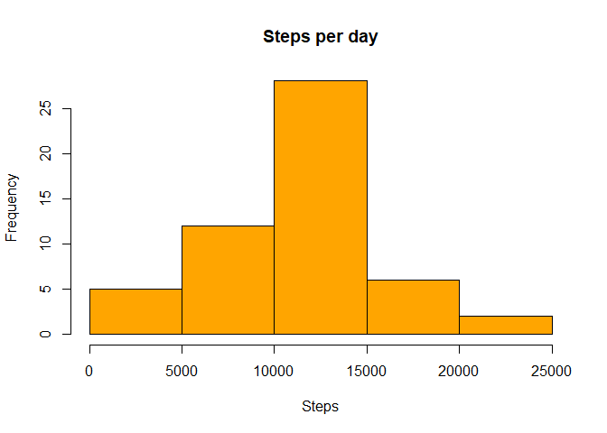
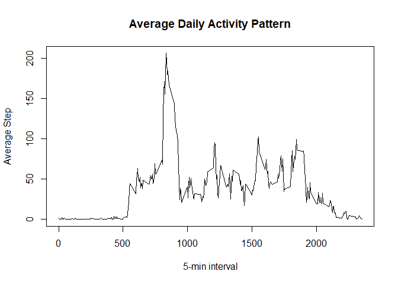
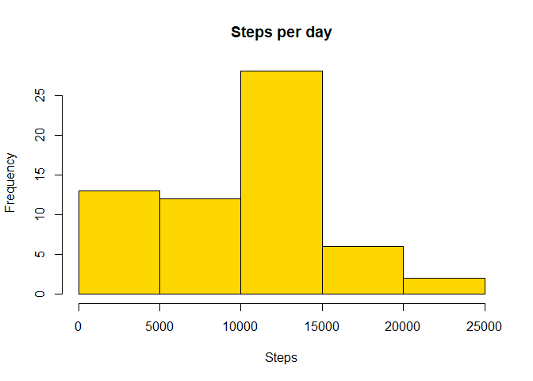
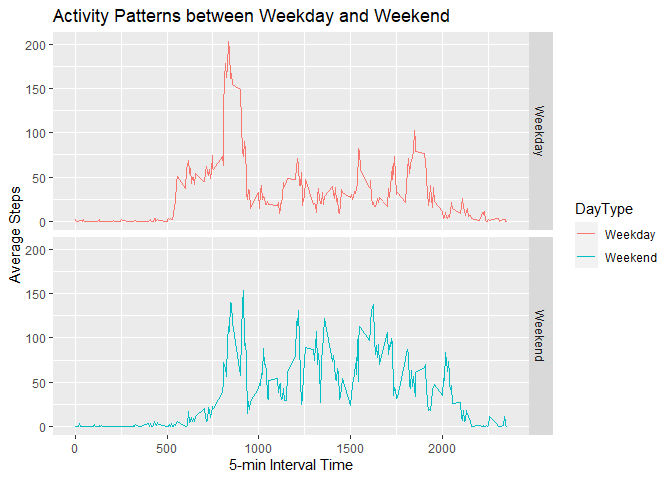

## **Loading and preprocessing the data**


```r
library(dplyr)
library(data.table)
library(ggplot2)
```
In this Reproducible Research Assessment R packages of "dplyr","data.table", and "ggplot2" has been load into R. The link of original source file is as below.

["https://d396qusza40orc.cloudfront.net/repdata%2Fdata%2Factivity.zip"]


```r
download.file("https://d396qusza40orc.cloudfront.net/repdata%2Fdata%2Factivity.zip", 
              destfile = "./cloudfront.zip")
unzip("./cloudfront.zip")
Data<-read.csv("./activity.csv", na.string = "NA")
print(str(Data))
```

```
## 'data.frame':	17568 obs. of  3 variables:
##  $ steps   : int  NA NA NA NA NA NA NA NA NA NA ...
##  $ date    : chr  "2012-10-01" "2012-10-01" "2012-10-01" "2012-10-01" ...
##  $ interval: int  0 5 10 15 20 25 30 35 40 45 ...
## NULL
```
With the using of str() function to check the variable type for activity data(Data). 
Before plotting histogram using aggregate function on the activity data by sum up the steps based on date. After that a histogram is plot using code as below.


```r
CData<-aggregate(formula = steps~date,data = Data,FUN = sum)
hist(CData$steps,col ="orange", xlab="Steps",main ="Steps per day")
```

<!-- -->


## **What is mean total number of steps taken per day?**

```r
print(summary(CData))
```

```
##      date               steps      
##  Length:53          Min.   :   41  
##  Class :character   1st Qu.: 8841  
##  Mode  :character   Median :10765  
##                     Mean   :10766  
##                     3rd Qu.:13294  
##                     Max.   :21194
```
With using the summary function on aggregated data the mean for **total number of steps** is **10766** and the **median** will be **10765**.

## **What is the average daily activity pattern?**
To plot the average daily activity pattern line graph, another set of data has to be generate in order to complete the plot. Which is the data set of aggregate activity data by calculate the mean of steps based on interval time (5 minute interval). A line plot was plot using following code.

```r
CData2<-aggregate(steps~interval,Data,mean)
plot(steps~interval,data = CData2,type="l",ylab="Average Step",xlab="5-min interval",
     main = "Average Daily Activity Pattern")
```

<!-- -->


```r
print(CData2[which.max(CData2$steps),1])
```

```
## [1] 835
```
Using the code above we can identify at morning **0835** time will have most of the step activity occur.

## **Imputing missing values**

```r
print(sum(is.na(Data$steps)))
```

```
## [1] 2304
```
With the code above we can see that there are total of **2304 missing data** in the steps variable.
**0** has been add as the value for missing data in steps variable. After that proceed with aggregate the non missing value data to sum up the steps based on date, and a histogram was plot afterward as the code show below.


```r
CData3<-Data
CData3[is.na(CData3$steps),1]<-0
CData3<-aggregate(steps~date,CData3,sum)
hist(CData3$steps,col ="gold", xlab="Steps",main ="Steps per day")
```

<!-- -->


```r
print(summary(CData3))
```

```
##      date               steps      
##  Length:61          Min.   :    0  
##  Class :character   1st Qu.: 6778  
##  Mode  :character   Median :10395  
##                     Mean   : 9354  
##                     3rd Qu.:12811  
##                     Max.   :21194
```
From the summary for non missing data we can see that the total steps **mean** is **9354** and the **median** will be **10395**

## **Are there differences in activity patterns between weekdays and weekends?**
Before answering this question we need to go through some data processing based on previous str() function we notice that the date variable are "character" type. Hence, data convert is needed for the date variable before using the weekdays() function. Below is the code that go thought the data process. 

```r
CData4<-Data
CData4[is.na(CData4$steps),1]<-0
CData4$date<-as.POSIXct(CData4$date, format = "%Y-%m-%d" )
CData4$Day<-weekdays(CData4[,2])
CData4$DayType<-as.factor(ifelse(CData4[,4]=="Sunday"| CData4[,4]=="Saturday"
                                 ,"Weekend","Weekday"))
WEData<-subset(CData4, DayType =="Weekend")
WDData<-subset(CData4, DayType == "Weekday")

WEData<-aggregate(steps~interval,WEData,mean)%>%mutate(DayType = "Weekend")
WDData<-aggregate(steps~interval,WDData,mean)%>%mutate(DayType ="Weekday")
CData4<-rbind(WEData,WDData)
```

The plot was plotting using ggplot the code and the plot are as below.

```r
graph<-ggplot(data = CData4, aes(x=interval,y=steps,color=DayType))
graph<-graph+geom_line()+facet_grid(DayType~.)+ylab("Average Steps")
graph<-graph+xlab("5-min Interval Time")
graph<-graph+ggtitle("Activity Patterns between Weekday and Weekend")
print(graph)
```

<!-- -->

This is the end of the Reproducible Research Assessment 1. Feel free to check on "RepDataAnalysis.R" R scrip which is the code as above.
